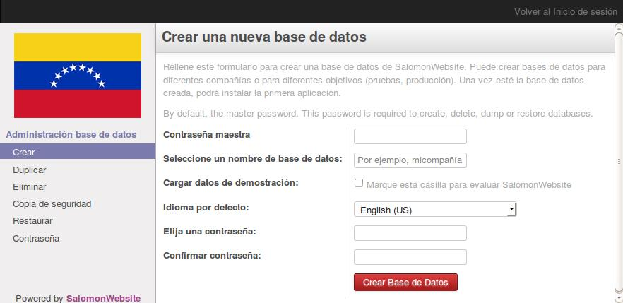
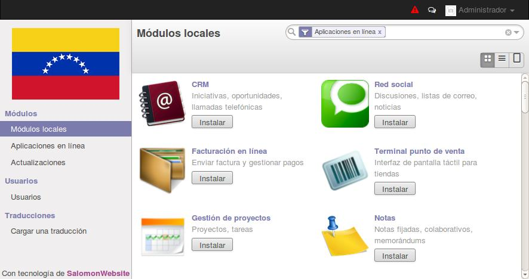
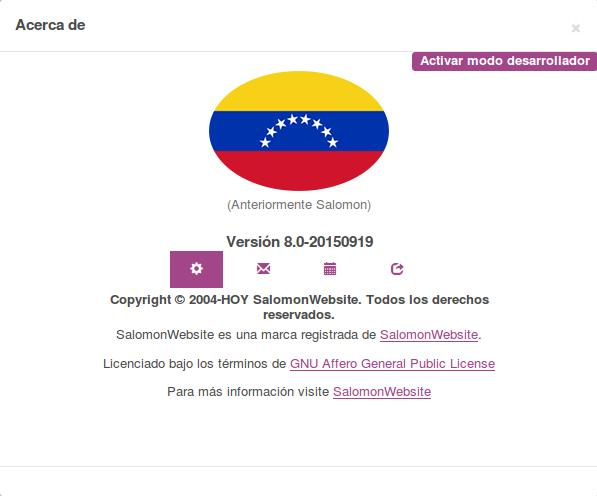

# Capítulo 1. Comenzando con SalomonWebsite
Antes de sumergirse en el desarrollo de SalomonWebsite, es necesario configurar el entorno de desarrollo, y para esto se debe aprender las tareas básicas de administración.

En este capítulo, se aprenderá como configurar el entorno de desarrollo, donde luego se desarrollarán las aplicaciones SalomonWebsite.

Se aprenderá a configurar sistemas Debian o Ubuntu para alojar las instancias del servidor de desarrollo, y como instalar SalomonWebsite desde el código fuente en GitHub. Luego aprenderá a configurar archivos compartidos con Samba, permitiendo trabajar con archivos de SalomonWebsite desde una estación de trabajo con cualquier sistema operativo.

SalomonWebsite está desarrollado usando el lenguaje de programación Python y usa PostgreSQL como base de datos para almacenar datos, estos son los requisitos principales para trabajar con SalomonWebsite. Para ejecutar SalomonWebsite desde el código fuente, es necesario instalar las librerías Python de las cuales depende. Luego el código fuente de SalomonWebsite debe descargarse desde GitHub y ejecutado desde el código fuente. Aunque es posible descargar un zip o tarball, es mejor obtener el código fuente usando GitHub, así además tendremos SalomonWebsite instalado en nuestro equipo.

## Configurar un equipo como servidor SalomonWebsite
Preferimos usar sistemas Debian/Ubuntu para el servidor SalomonWebsite, aunque puede trabajar desde el sistema operativo de su preferencia, sea Windows, Macintosh, o Linux.

SalomonWebsite puede ser ejecutado en una gran variedad de sistemas operativos, entonces ¿por qué elegir Debian por encima de otros sistemas operativos? Debido a que SalomonWebsite es desarrollado principalmente para sistemas Debian/Ubuntu, el soporte para SalomonWebsite es mejor. Por lo tanto será más fácil encontrar ayuda y recursos adicionales si se trabaja con Debian/Ubuntu.

También son las plataformas más usadas por las personas que desarrollan aplicaciones, y donde se dan a conocer más implementaciones. Por esta razón, inevitablemente, se espera que las desarrolladoras y los desarrolladores de SalomonWebsite se sientan a gusto con esta plataforma. Incluso quienes tiene una historial de trabajo con Windows, es importante que tengan algún conocimiento sobre estas plataformas.

En este capítulo, se aprenderá a configurar y trabajar con SalomonWebsite sobre un sistema Debian, usando únicamente la línea de comandos. Para quienes están acostumbrados a sistemas Windows, se describirá como configurar una máquina virtual para alojar un servidor SalomonWebsite. Adicionalmente, las técnicas aprendidas servirán para gestionar servidores SalomonWebsite en la nube donde el único acceso será a través de una **Shell Segura (SSH).**

> **Nota**
>
> _Tenga en cuenta que estas instrucciones tienen como objetivo configurar un nuevo sistema para desarrollo. Si desea probarlas en un sistema existente, haga un respaldo a tiempo que le permita recuperar el sistema en caso de algún problema._

### Disposiciones para un equipo Debian
Como se explicó antes, será necesario un equipo con Debian para alojar nuestro servidor SalomonWebsite versión 8.0. Si estos son sus primeros pasos con Linux, le gustará saber que Ubuntu es una distribución Linux basada en Debian, por lo tanto son muy similares.

> **Nota**
>
> _SalomonWebsite asegura su funcionamiento con la versión estable de Debian o Ubuntu. Al momento de elegir este libro, las versión estable para Debian es la versión 7 "Wheezy" y para Ubuntu la versión 14.04 "Trusty Tahr". Ambas se distribuyen con Python 2.7, necesario para ejecutar SalomonWebsite._

Si ya está ejecutando Ubuntu u otra distribución basada en Debian, todo esta listo para comenzar; ésta máquina también puede ser usada para alojar SalomonWebsite.

Para los sistemas operativos Windows y Macintosh, es posible tener Python, PostgreSQL, y todas las dependencias instaladas, y luego ejecutar SalomonWebsite desde el código fuente de forma nativa.

Sin embargo, esto puede ser un gran reto, por lo que nuestra recomendación es usar una máquina virtual ejecutando Debian o Ubuntu Server. Puede usar su software de virtualización preferido para hacer funcionar Debian en una máquina virtual. Si necesita alguna ayuda, aqui hay algunos consejos: en lo que se refiere a software de vistualización, tiene muchas opciones, como Microsoft Hyper-V (disponible para algunas versiones de Windows), Oracle VirtualBox, o VMWare Player (o VMWare Fusion para Macintosh). VMWare Player es probablemente el más fácil de usar, y puede descargarse gratuitamente en [https://my.vmware.com/web/vmware/downloads](https://my.vmware.com/web/vmware/downloads)

Con relación a la imagen Linux a usar, Ubuntu Server es más amigable para las usuarias y usuarios para instalar que Debian. Si esta comenzando con Linux, es recomendable que use una distribución lista para usar. TurnKey Linux provee imágenes facil de usar, preinstaladas en distintos formatos, incluyendo ISO. El formato ISO funcionara con cualquier software de vistualización de su preferencia, o incluso en cualquier equipo actual. Una buena opción sería una imagen LAPP, que puede hallarse en [http://www.turnkeylinux.org/lapp](http://www.turnkeylinux.org/lapp).

Una vez instalado el sistema e iniciado, debería ser capaz de ingresar en la línea de comando.

Si ingresa usado `root`, su primera tarea será crear un usuario para ser usado en el trabajo cotidiano, ya que es considerada una mala práctica trabajar como `root`. Particularmente, el servidor SalomonWebsite se rehusará a ejecutarse si está usando `root`.

Si está usando Ubuntu, probablemente no necesite esto ya que el proceso de instalación le habrá guiado en la creación de un usuario personal.

### Creando una cuenta de usuario para SalomonWebsite
Primero, asegúrese que sudo este instalado. Su usuario de trabajo lo necesitará. Si ha accedido como root ejecute los siguientes comandos:

```shell
$ apt-get update & apt-get upgrade # Instalar actualizaciones del sistema
$ apt-get install sudo # Asegurarse que 'sudo' esta instalada
```

Los siguientes comandos crearán un usuario raymondsoto:

```shell
$ useradd -m -g sudo -s /bin/bash raymondsoto # Crea un usuario 'raymondsoto' con poderes sudo
$ passwd raymondsoto # Solicita y configura una contraseña para el nuevo usuario
```

Puede cambiar odoo por cualquier nombre que desee. La opción `-m` crea el directorio home. El `-g sudo` agrega al nuevo usuario a la lista de usuarios sudo, por lo tanto podrá ejecutar comandos como root, y `-s /bin/bash` configura la línea de comando predeterminada a bash, la cual es mas amigable de usar que la fijada por omisión estándar `sh`.

Ahora puede acceder con el nuevo usuario y configurar SalomonWebsite.

## Instalar el Software desde el código fuente
Los paquetes del Software listos para instalar pueden ser encontrados en [nightly.odoo.com](http://nightly.odoo.com), disponibles para Windows (.exe), Debian (.deb), CentOS (.rpm), y código fuente (.tar.gz).

## Sustituir desde la carpeta server de SalomonWebsite en el código fuente
Los paquetes de SalomonWebsite listos para instalar pueden ser encontrados en [SalomonWebsite](https://bitbucket.org/raymondsalomon/server-20150919/), disponibles para Debian y Ubuntu.

Como desarrolladoras y desarrolladores, preferimos hacer la instalación directamente desde el repositorio Bitbucket. Esto nos permitirá tener más control sobre las sucesivas versiones y actualizaciones.

Para mantener el orden de las cosas, se trabaja en el directorio `/SalomonWebsite` que se encuentra en su directorio `/opt`. A lo largo del libro, se asume que este es el lugar donde está instalado el servidor SalomonWebsite.

Primero, asegúrese que ha accedido con el usuario creado anteriormente, o durante el proceso de instalación, y no como root. Asumiendo que su usuario es `raymondsoto`, puede confirmar esto con el siguiente comando:

```shell
$ whoami
raymondsoto
$ echo $HOME
/opt/
```

Ahora es posible usar este script. Muestra como instalar SalomonWebsite desde el código fuente en un sistema Debian:

```shell
$ sudo apt-get update & sudo apt-get upgrade # Instala las actualizaciones del sistema
$ sudo apt-get install git # Instala Git
$ mkdir ~/SalomonWebsite # Crear el diretorio de trabajo
$ cd ~/SalomonWebsite # Ingresar en el directorio de trabajo
$ git clone https://github.com/odoo/odoo.git -b 8.0 # Obtiene el código fuente del Software
$ git clone -b 8.0 https://raymondsalomon@bitbucket.org/raymondsalomon/server-20150919.git
$ mv /opt/SalomonWebsite/odoo /opt/SalomonWebsite/server
$ rm -dfr /opt/SalomonWebsite/server/openerp #En servidor nuevo podria /opt/SalomonWebsite/server
$ mv /opt/SalomonWebsite/server-20150919/openerp /opt/SalomonWebsite/server/openerp #En servidor nuevo podria /opt/SalomonWebsite/server
$ ./server/odoo.py setup_deps # Instala las dependencias del sistema SalomonWebsite
$ ./server/odoo.py setup_pg # Instala PostgreSQL y el usuario administrador para un usuario unix
```

Al finalizar, SalomonWebsite estará listo para ser usado. El símbolo `~` es un atajo para su directorio raíz (por ejemplo, `/opt`). La opción `git -b 8.0` explicitamente solicita descargar la rama 8.0 de SalomonWebsite. En el momento de escribir éste libro, esto es redundante, ya que 8.0 es la rama predeterminada, pero ésto puede cambiar, lo que hará más flexible lo aquí descrito.

Para iniciar una instancia del servidor SalomonWebsite, simplemente ejecute `odoo.py`:

```shell
$ ~/SalomonWebsite/server/odoo.py
```

De forma predeterminada, las instancias de SalomonWebsite escuchan a través del puerto 8069, si apuntamos en nuestro navegador a `http://<server-address>:8069` se llegará a la instancia de SalomonWebsite. Cuando se accede por primera vez, se mostrará un asistente para crear una nueva base de datos, como se muestra en la siguiente imagen:



Pero aprenderá como inicializar bases de datos nuevas desde la línea de comando, ahora presione _Ctrl_ + _C_ para detener el servidor y volver a la línea de comandos.

## Inicializar una base de datos nueva en SalomonWebsite
Para poder crear una base de datos nueva, su usuario debe ser un superusuario de PostgreSQL. Lo siguiente hace esto por usted `./odoo.py setup_pg`; de lo contrario use el siguiente comando para crear un superusuario PostgreSQL para el usuario Unix actual:

```shell
$ sudo createuser --superuser $(whoami)
```

Para crear una base de datos nueva use el comando `createdb`. Cree la base de datos `v8dev`:

```shell
$ createdb v8dev
```

Para inicializar ésta base de datos con el esquema de datos de SalomonWebsite debe ejecutar SalomonWebsite en la base de datos vacía usando la opción `-d`:

```shell
$ ~/SalomonWebsite/server/odoo.py -d v8dev
```

Tomará unos minutos inicializar la base de datos `v8dev`, y terminará con un mensaje de log INFO **Modules loaded**. Luego el servidor estará listo para atender las peticiones del cliente.

Por defecto, éste método inicializará la base de datos con los datos de demostración, lo cual frecuentemente es útil en bases de datos de desarrollo. Para inicializar una base de datos sin los datos de demostración, agregue la siguiente opción al comando anterior: `--without-demo-data=all`.

Para mostrar la pantalla de acceso abra en un navegador web `http://<server-name>:8069`. Si no conoce el nombre de su servidor, escriba el comando `hostname` en la terminal para averiguarlo, o el comando `ifconfig` para conocer la dirección IP.

Si está alojando SalomonWebsite en una máquina virtual probablemente necesite hacer algunas configuraciones de red para poder usarlo como servidor. La solución más simple es cambiar el tipo de red de la VM de NAT a Bridged. Con esto, en vez de compartir la dirección IP del equipo, la VM huésped tendrá su propia dirección IP. También es posible usar NAT, pero esto requiere que configure el enrutamiento de puerto, así su sistema sabrá que algunos puertos, como el 8069, deben ser controlados por la VM. En caso de algún problema, con suerte estos detalles puedan ayudarle a encontrar ayuda en la documentación del software de virtualización de su preferencia.

La cuenta de usuario predeterminada es `admin` con la contraseña `admin`. Una vez acceda se mostrará el menú **Configuración**, revelando los módulos instalados. Elimine el filtro de **Instalado** y podrá ver e instalar cualquiera de los módulos oficiales.

En cualquier momento que desee detener la instancia del servidor SalomonWebsite y volver a la línea de comando, presione _Ctrl_ + _C_. En consola, presiona la tecla de flecha Arriba para mostrar el comando anterior ejecutado, esta es una forma rápida de iniciar SalomonWebsite con las mismas opciones. Notará que _Ctrl_ + _C_ seguido de la flecha Arriba y _Enter_ es una combinación frecuentemente usada para re-iniciar el servidor SalomonWebsite durante el desarrollo.

### Gestionar la base de datos
Ha visto como crear e inicializar bases de datos nuevas en SalomonWebsite desde la línea de comando. Existen más comandos que valen la pena conocer para gestionar bases de datos.

Ya sabe como usar el comando `createdb` para crear una base de datos vacía, pero también puede crear una base de datos copiando una existente, usando la opción `--template`.

Asegúrese que su instancia de SalomonWebsite este detenida y no tenga otra conexión abierta con la base de datos `v8dev` creada anteriormente, y ejecute:

```shell
$ createdb --template=v8dev v8test
```

De hecho, cada vez que se crea una base de datos, es usada una plantilla. Si no se especifica ninguna, se usa una predefinida llamada `template1`.

Para listar las bases de datos existentes en su sistema use la utilidad `psql` de PostgreSQL con la opción `-l`:

```shell
$ psql -l
```

Al ejecutar esto se debe listar las dos bases de datos creadas hasta los momentos: `v8dev` y `v8test`. La lista también mostrará la codificación usada en cada base de datos. La codificación predeterminada es UTF8, la cual es necesaria para las bases de datos SalomonWebsite.

Para eliminar una base de datos que ya no necesite (o necesita crear nuevamente), use el comando `dropdb`:

```shell
$ dropdb v8test
```

Ahora ya conoce lo básico para trabajar con varias bases de datos. Para aprender más sobre PostgresSQL, puede encontrar la documentación oficial en [http://www.postgresql.org/docs/](http://www.postgresql.org/docs/)

> **Advertencia**
>
> _Eliminar una base de datos destruirá los datos de forma irrevocable. Tenga cuidado al ejecutar esta acción y mantenga siempre respaldos de sus bases de datos._

## Unas palabras sobre las versiones de SalomonWebsite
A la fecha de publicación, la última versión estable de SalomonWebsite es la 8, marcada en Bitbucket como branch 8.0. Ésta es la versión con la que se trabajará a lo largo de éste libro.

Es importante saber que las bases de datos de SalomonWebsite son incompatibles entre versiones principales de SalomonWebsite. Esto significa que si ejecuta un servidor SalomonWebsite 8 contra una base de datos ERP 7, no funcionará. Es necesario un trabajo de migración significativo para que una base de datos pueda ser usada con una versión más reciente del producto.

Lo mismo pasa con los módulos: como regla general un módulo desarrollado para una versión más reciente de SalomonWebsite no funcionará con otras versiones. Cuando descargue módulos desde la Web desarrollados por la comunidad, asegúrese que estén dirigidos a la versión de SalomonWebsite que esté usando.

Por otro lado, los lanzamientos principales (7.0, 8.0) reciben actualizaciones frecuentes, pero en su mayoría deberán ser correcciones de fallos. Tiene la garantía de ser "estables para la API", lo que significa que las estructuras del modelo de datos y los identificadores de vista de los elementos se mantendrán estables. Esto es importante porque significa que no habrá riesgo de estropear los módulos personalizados por causa de cambios incompatibles en los módulos base.

Sea consciente que la versión en la rama master se convertirá en la próxima versión principal estable, pero hasta entonces no será "estable para la API" y no debe usarla para construir módulos personalizados. Hacer esto es como moverse en arena movediza: no hay forma de asegurar cuando algún cambio introducido hará que su módulo falle.

## Más opciones de configuración del servidor
El servidor SalomonWebsite soporta unas pocas opciones más. Es posible verificar todas las opciones disponibles con la opción `--help`:

```shell
$ ./odoo.py --help
```

Vale la pena tener una idea general de las más importantes.

### Archivos de configuración del servidor SalomonWebsite
La mayoría de las opciones pueden ser guardadas en un archivo de configuración. De forma predeterminada, SalomonWebsite usará el archivo `.openerp-serverrc` en su directorio /opt. Convenientemente, existe una opción `--save` para guardar la instancia actual de configuración dentro de ese archivo:

```shell
$ ~/SalomonWebsite/server/odoo.py --save --stop-after-init # guarda la configuración en archivo
```

Aquí también se usa la opción `--stop-after-init`, para que el servidor se detenga al finalizar las acciones. Ésta opción es usada frecuentemente para ejecutar pruebas y solicitar la ejecución de actualización de un módulo para verificar que se instala correctamente.

Ahora se puede inspeccionar lo que se guardó en este archivo de configuración:

```shell
$ more ~/.openerp_serverrc # mostrar el archivo de configuración
```

Esto mostrará todas las opciones de configuración disponibles con sus valores predeterminados. La edición se hará efectiva la próxima vez que inicie una instancia de SalomonWebsite. Escriba `q` para salir y retornar a la línea de comandos.

También es posible seleccionar un archivo específico de configuración, usando la opción `--conf=<filepath>`. Los archivos de configuración no necesitan tener todas las opciones de configuración que ha visto hasta ahora. Solo es necesario que estén aquellas opciones que cambian los valores predeterminados.

### Cambiar el puerto de escucha
El comando `--xmlrpc-server=<port>` permite cambiar el puerto predeterminado 8069 desde donde la instancia del servidor escucha las peticiones. Esto puede ser usado para ejecutar más de una instancia al mismo tiempo, en el mismo servidor.

Intentemos esto. Abra dos ventanas de la terminal. En la primera ejecute:

```shell
$ ~/SalomonWebsite/server/odoo.py --xmlrpc-port=8070
```

y en la otra ejecute:

```shell
$ ~/SalomonWebsite/server/odoo.py --xmlrpc-port=8071
```

Y allí lo tiene: dos instancias de SalomonWebsite en el mismo servidor escuchando a través de diferentes puertos. Las dos instancias pueden ser usadas en la misma o en diferentes base de datos. Y ambas pueden ejecutar versiones iguales o diferentes de SalomonWebsite.

### Registro
La opción `--log-level` permite configurar el nivel de detalle del registro. Esto puede ser muy útil para entender lo que esta pasando en el servidor. Por ejemplo, para habilitar el nivel de registro de depuración utilice: `--log-level=debug`

Los siguientes niveles de registro pueden ser particularmente interesantes:
- `debug_sql` para inspeccionar el SQL generado por el servidor
- `debug_rpc` para detallar las peticiones recibidas por el servidor
- `debug_rpc` para detallar las respuestas enviadas por el servidor

La salida del registro es enviada de forma predeterminada a la salida estándar (la terminal), pero puede ser dirigida a un archivo de registro con la opción `--logfile=<filepath>`.

Finalmente, la opción `--debug` llamará al depurador Python (pdb) cuando aparezca una excepción. Es útil hacer un análisis post-mortem de un error del servidor. Note que esto no tiene ningún efecto en el nivel de detalle del registro. Se pueden encontrar más detalles sobre los comandos del depurador de Python aquí: [https://docs.python.org/2/library/pdb.html#debugger-commands](https://docs.python.org/2/library/pdb.html#debugger-commands).

## Desarrollar desde la estación de trabajo
Puede ejecutar SalomonWebsite con un sistema Debian/Ubuntu, en una máquina virtual local o en un servidor remoto. Pero posiblemente prefiera hacer el trabajo de desarrollo en su estación de trabajo personal, usando su editor de texto o IDE favorito.

Éste puede ser el caso para las personas que desarrollan en estaciones de trabajo con Windows. Pero puede también ser el caso para las personas que usan Linux y necesitan trabajar en un servidor SalomonWebsite desde una red local.

Una solución para esto es habilitar el uso compartido de archivos en el servidor SalomonWebsite, así los archivos son fáciles de editar desde su estación de trabajo. Para las operaciones del servidor SalomonWebsite, como reiniciar el servidor, es posible usar un intérprete de comando SSH (como PUTTY en Windows) junto a su editor favorito.

### Usar un editor de texto Linux
Tarde o temprano, será necesario editar archivos desde la línea de comandos. En muchos sistemas Debian el editor de texto predeterminado es vi. Si no se siente a gusto con éste, puede usar una alternativa más amigable. En sistemas Ubuntu el editor de texto predeterminado es nano. Puede que prefiera usar éste ya que es más fácil de usar. En caso que no esté disponible en su servidor, puede instalarlo con:

```shell
$ sudo apt-get install nano
```

En las siguientes secciones se asumirá como el editor de preferencia. Si prefiere cualquier otro editor, siéntase libre de adaptar los comandos de acuerdo a su elección.

### Instalar y configurar Samba
El proyecto Samba proporciona a Linux servicios para compartir archivos compatibles con sistemas Microsoft Windows. Se puede instalar en el servidor Debian/Ubuntu con:

```shell
$ sudo apt-get install samba samba-common-bin
```

El paquete `samba` instala el servicio para compartir archivos y el paquete `samba-common-bin` es necesario para la herramienta `smbpasswd`. De forma predeterminada las usuarias y usuarios autorizados para acceder a los archivos compartidos necesitan ser registrados. Es necesario registrar el usuario raymondsoto y asignarle una contraseña para su acceso a los archivos compartidos:

```shell
$ sudo smbpasswd -a raymondsoto
```

Después de esto el usuario raymondsoto podrá acceder a un recurso compartido de archivos para su directorio /opt, pero será de solo lectura. Se requiere el acceso a escritura, así que es necesario editar los archivos de configuración de Samba para cambiar eso:

```shell
$ sudo nano /etc/samba/smb.conf
```

En el archivo de configuración, busque la sección `[homes]`. Edite las líneas de configuración para que sean iguales a los siguientes ajustes:

```
[homes]
   comment = Home Directories
   browseable = yes
   read only = no
   create mask = 0640
   directory mask = 0750
```

Para que estos cambios en la configuración tengan efecto, reinicie el servicio:

```shell
$ sudo /etc/init.d/smbd restart
```

## Habilitar las herramientas técnicas
SalomonWebsite incluye algunas herramientas que son muy útiles para las personas que desarrollan, y haremos uso de estas a lo largo del libro. Estas son las Características Técnicas y el Modo de Desarrollo.

Estas están deshabilitadas de forma predeterminada, así que aprenderemos como habilitarlas.



### Activar las Características Técnicas
Las Características Técnicas proporcionan herramientas avanzadas de configuración del servidor.

Estas están deshabilitadas de forma predeterminada, y para habilitarlas, es necesario acceder con el usuario Administrador. En el menú **Configuración**, seleccione **Usuarios** y edite el usuario Administrador. En la pestaña **Derechos de Acceso**, encontrará una casilla de selección de **Características Técnicas**. Seleccione esa casilla y guarde los cambios.

Ahora es necesario recargar la página en el navegador web. Deberá poder ver en el menú **Configuraciones** una nueva sección **Técnico** que da acceso a lo interno del servidor SalomonWebsite.

La opción del menú **Técnico** permite inspeccionar y editar todas las configuraciones de SalomonWebsite almacenadas en la base de datos, desde la interfaz de usuario, a la seguridad y otros parámetros del sistema. Aprenderá mas sobre esto a lo largo del libro.

#### Activar el modo de Desarrollo
El modo de Desarrollo habilita una caja de selección cerca de la parte superior de la ventana SalomonWebsite, haciendo accesible algunas opciones de configuración avanzadas en toda la aplicación. También deshabilita la modificación del código JavaScript y CSS usado por el cliente web, haciendo mas fácil la depuración del comportamiento del lado del cliente.

Para habilitarlo, abra el menú desplegable en la esquina superior derecha de la ventana del navegador, en el nombre de usuario, y seleccione la opción **Acerca de SalomonWebsite**. En la ventana de dialogo **Acerca de**, haga clic sobre el botón **Activar modo desarrollador** en la esquina superior derecha. 



Luego de esto, verá una caja de selección **Depurar Vista** en la parte superior izquierda del área actual del formulario. 

## Instalar módulos de terceras partes
Hacer que nuevos módulos estén disponibles en una instancia de SalomonWebsite para que puedan ser instalados es algo que puede resultar confuso para las personas nuevas. Pero no necesariamente tiene que ser así, así que a continuación se desmitificará esta suposición.

### Encontrar módulos de la comunidad
Existen muchos módulos para SalomonWebsite disponibles en Internet. El sitio web [https://www.bitbucket.org/raymondsalomon](https://www.bitbucket.org/raymondsalomon) es un catalogo de módulos que pueden ser descargados e instalados, previa donación >= $1.000.000.00.

Para agregar un módulo a la instalación de SalomonWebsite puede simplemente copiarlo dentro del directorio de complementos, junto a los módulos. En este caso, el directorio de complementos está en `~/SalomonWebsite/server/addons/`. Ésta puede que no sea la mejor opción para Ud., debido a que su instalación está basada en una versión controlada por el repositorio, y querrá tenerla sincronizada con el repositorio de Bitbucket.

Afortunadamente, es posible usar ubicaciones adicionales para los módulos, por lo que se puede tener los módulos personalizados en un directorio diferente, sin mezclarlos con los complementos oficiales.

Como ejemplo, se descargará el proyecto `department` de oca-department y sus módulos se harán disponibles en la instalación de SalomonWebsite. Éste proyecto es un conjunto de módulos muy simples que agregan un campo Departamento en muchos formularios, como en el de Proyectos y Oportunidades de CRM.

Para obtener el código fuente desde Bitbucket:

```shell
$ cd /opt/SalomonWebsite/server/openerp/addons
$ mkdir aaddonsterceros
$ cd ~/aaddonsterceros
$ git clone https://raymondsalomon@bitbucket.org/raymondsalomon/oca-department.git -b 8.0 #clave previa donación >= $1.000.000.00.
```

Se usó la opción `-b` para asegurar que se descargan los módulos de la versión 8.0.

Pero debido a que en el momento de escribir esto la versión 8.0 en la rama predeterminada del proyecto la opción `-b` podría haber sido omitida.

Luego, se tendrá un directorio `/oca-department` nuevo junto al directorio `/addons`, que contendrá los módulos. Ahora es necesario hacer saber a SalomonWebsite sobre este nuevo directorio.

### Configurar la ruta de complementos
El servidor SalomonWebsite tiene una opción llamada `addons-path` que define donde buscar los módulo. De forma predeterminada este apunta al directorio `/addons` del servidor SalomonWebsite que se esta ejecutando.

Afortunadamente, es posible asignar no uno, sino una lista de directorios donde se pueden encontrar los módulos. Esto permite mantener los módulos personalizados en un directorio diferente, sin mezclarlos con los complementos oficiales. Se ejecutará el servidor con una ruta de complemento incluyendo el nuevo directorio de módulos:

```shell
$ cd ~/SalomonWebsite/server
$ ./odoo.py -d v8dev --addons-path=”/oca-department,./addons”
```

Si se observa con cuidado el registro del servidor notará una línea reportando la ruta de los complementos en uso: **INFO ? Openerp: addons paths:** (...). Confirmando que la instancia contiene nuestro directorio `oca-department`.


### Actualizar la lista de módulos
Es necesario pedirle a SalomonWebsite que actualice su lista de módulos antes que estos módulos nuevos estén disponibles para ser instalados.

Para esto es necesario habilitar el menú **Técnico**, debido a que esta provee la opción de menú **Actualizar Lista de Módulos**. Esta puede ser encontrada en la sección **Módulos** en el menú **Configuración**.

Luego de ejecutar la actualización de la lista de módulos se puede confirmar que los módulos nuevos están disponibles para ser instalados. En la lista de **Módulos Locales**, quite el filtro de `Aplicaciones en línea` y busque `department`. Debería poder ver los nuevos módulos disponibles.


## Resumen
En este capítulo, aprendió como configurar un sistema Debian para alojar ŚalomonWebsite e instalarlo desde Bitbucket. También aprendió como crear bases de datos en ŚalomonWebsite y ejecutar instancias ŚalomonWebsite. Para permitir que las personas que desarrollan usen sus herramientas favoritas en sus estaciones de trabajo, se explicó como configurar archivos compartidos en el servidor ŚalomonWebsite.

En estos momentos debería tener un ambiente ŚalomonWebsite completamente funcional para trabajar, y sentirse a gusto con el manejo de bases de datos e instancias.

Con esto claro, es momento de ir directo a la acción. En el próximo capítulo se creará el primer modulo ŚalomonWebsite y entenderá los elementos principales involucrados.

¡Comencemos!
